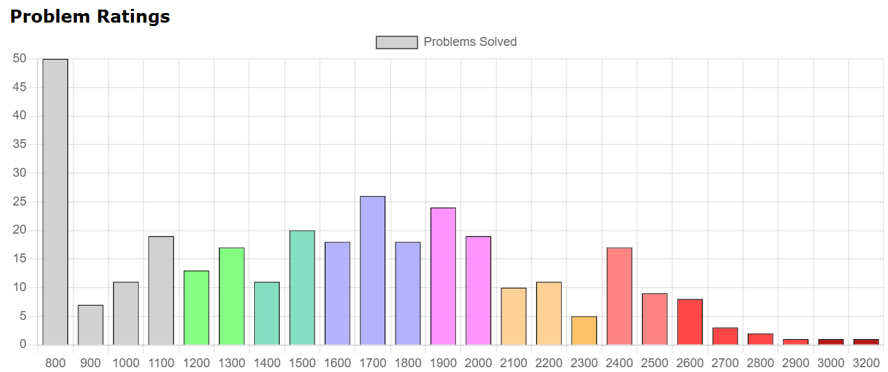
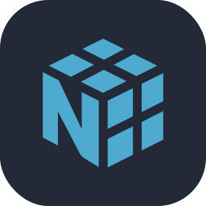
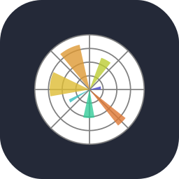
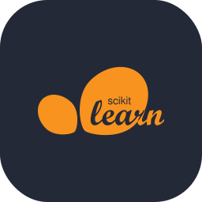

<h1 align="center">🚨 You might be entering my profile page! 🚨</h1>

  

## About Me 👤

I am **Paulo Vitor Correia de Oliveira**, a Brazilian student at IMPA Tech pursuing a Bachelor’s in **Mathematics of Technology and Innovation**, specializing in **Computer Science**. I am a mathematician and computer scientist, particularly interested in **Machine Learning**, **Graph Theory**, **Algorithms**, and **Game Theory**. As a developer, I focus on web development, task automation, and building custom tools to extract or analyze data for project-specific needs.

Talking a bit more about some things I'm interested in...

- **AI and Machine Learning 🧠:** Beyond university courses in Machine Learning, I conducted undergraduate research through **PICME** on **Machine Learning applied to Differential Equations**. I developed a neural network to predict the optimal launch angle and velocity for an object to hit a target in a 2D space, while accounting for the gravitational interactions between the projectile and other objects in space. The core idea was to use a **PINN** to learn how to describe the optimal angle and intensity as a function of the target position, while also considering the gravitational interactions as a parameter or hyperparameter.

- **Algorithms and Competitive Programming 💻:** I have participated in algorithms related undergraduate research projects through **[PICME](https://picme.obmep.org.br/)**, focusing on the subjects **Graph Theory and Its Algorithms** and **Unveiling the Mysteries of Sorting**. I was part of **Impatecode**, a university extension project dedicated to competitive programming. I enjoy solving problems on various platforms, particularly **[CSES](https://cses.fi/user/247527)**, where I have solved **221 problems**, and **[Codeforces](https://codeforces.com/profile/ColchaoDeMolasEnsacadas)**, with **348 problems** solved to date.

  

- **Software Development 🧑‍💻:** I build software with some purpose, be it to simplify daily routines, transform how we visualize and interpret data or as a tool used to facilitate the gathering of information in some way. My portfolio is a mix of utility applications and passion projects developed for the sheer fun of it. While part of my work is public on GitHub, I also maintain a variety of private experiments and personal tools.

- **Pure and Applied Mathematics 🧮:** While my professional focus is currently centered on computer science and programming, my foundation is built entirely on mathematics. My journey began with an immersion in both pure and applied math, a path marked by olympiads and a passion for high-level problem-solving. These years spent reading and writing mathematical proofs and national competitions were very important, being the place where I forged the analytical mindset I bring to code I write today. This mathematical side remains a core part of my identity as a background that has allowed me to approach software as a logical extension of the mathematical principles I have studied for years.

## Main Skills 💡

These are the skills I'm the most profficient on the moment of this profile update.

### Languages ⌨️

  

### Technologies 🛠 

  

### Libraries 📚

  &nbsp;
  &nbsp;
  &nbsp;
  &nbsp;
  &nbsp;
  &nbsp;

## Contributions 🟩

<table>
  <tr>
    <td style="border: none;">
      
    </td>
    <td style="border: none;">
        
    </td>
  </tr>
</table>

  

